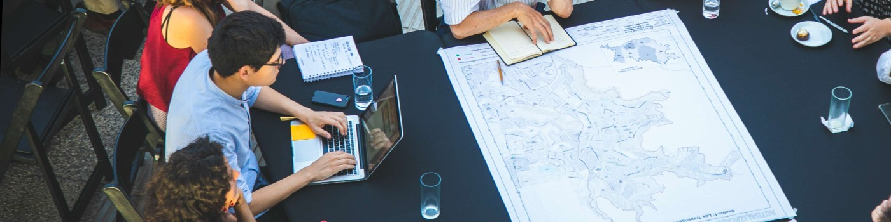

# About

Hello!

Meet Ariel, a passionate engineer who is currently pursuing a master's degree in design with a special focus on creating voice interfaces for children. With a strong background in engineering, Ariel has always been fascinated by the power of technology to improve people's lives, and believes that by designing user-friendly and engaging voice interfaces, children can be given a voice and empowered to express themselves in a way that is natural to them.

What sets Ariel apart is their commitment to creating voice interfaces that do not infantilize children. Instead, they believe in giving children the respect they deserve by designing interfaces that are age-appropriate, but not condescending or overly simplistic. By leveraging their technical expertise and design skills, Ariel aims to create interfaces that allow children to express themselves, learn, and have fun in a way that is authentic and empowering.

With a strong passion for creating positive impact through technology, Ariel is dedicated to leveraging their skills and knowledge to make a difference in the lives of children. Whether it's designing interfaces for education, entertainment, or communication, Ariel is always focused on creating interfaces that are engaging, intuitive, and designed with the needs of people in mind.
