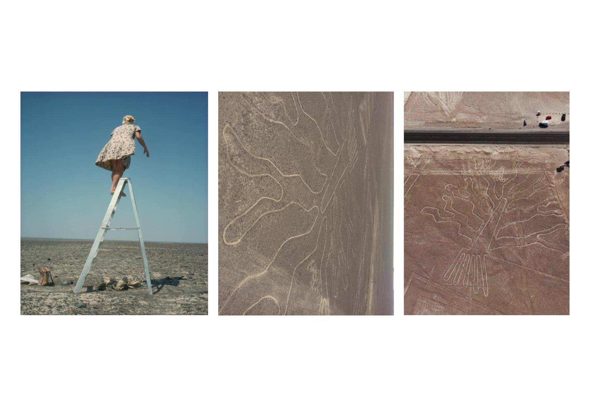
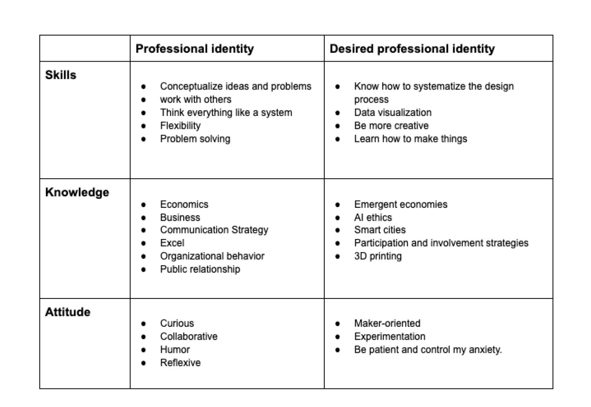
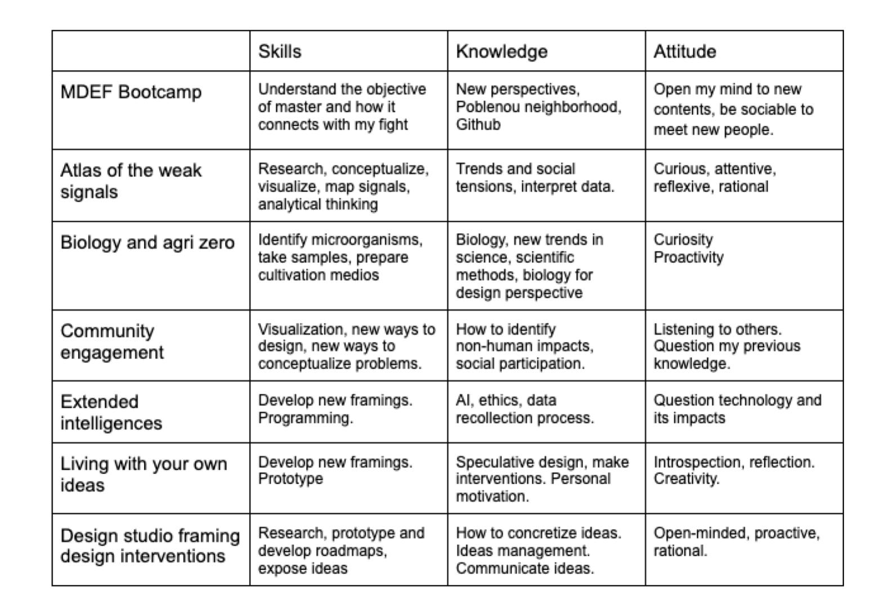
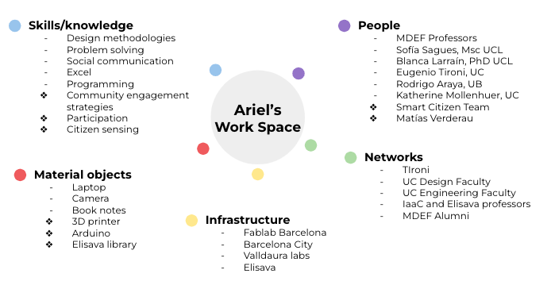

---
hide:
    - toc
---

# Design Studio

## My fight

My fight is to connect different perspectives, points of view or expectations, and create a system, a product or a service. It is the ability to translate two worlds, and create a new one.

These 3 photos represent this. She was Marie Reiche, a German archaeologist who traveled through South America with a ladder, because she realized that when you saw stones on the ground they meant nothing, but as you climbed the stairs the same stones formed a bird, a flower, a system. For me, she was a very good translator.

## Personal development plan

After sharing my fight and interests with my peers, I created my personal development plan, based on my previous experiences and my learning expectations.

## Analysis of my development

## Roles of prototyping: previous experience

When I was studying engineering, the most typical prototype I used was Role 1, related to testing different aspects or functions of my projects. In 2017 I was doing the course “Research, Innovation and Entrepreneurship” at the Faculty of Engineering, and my team and I developed a medical device to help "claw hands", a degenerative disease suffered by people with dementia and other types of ailments. It was a very extensive prototyping process, because we tested the dimensions, the materials, the technology and the physical exercises.

IMAGEN

Also, when I was in the “Visual Thinking” course, we were challenged to represent our conclusions after researching with public data. Role number 3. I investigated the relationship between quality of life and travel time from home to work. In that project I tried to represent inequality in Chile, because people who live in poor neighborhoods take longer time to go to work, while people who live in rich neighborhoods take a minimum time to go to work. I represented that with different tubes (printed in 3D), each one represented a neighborhood, and they moved towards the center at different speeds (with an engine and Arduino). The tubes representing the rich neighborhoods were faster than those representing the poor.

IMAGEN

## Roles of prototyping: new opportunities

My fight is to connect different perspectives, points of view or expectations, and create a new system, product or service. With this objective, role number 4, the prototyping process as a consultation vehicle, is very important, because if I want a good creation I have to worry about the process, and not just the final product/service. Legitimacy depends on how we build. I believe that this sentence can be explained with the same arguments used by the robotic arm in the text Prototypes and Prototyping in Design Research.

“But the robotic arm example is also one where the contribution to knowledge can only occur through an iterative prototyping process: we cannot discover the principles or requirements for building a robotic arm without thinking about design possibilities. , propose, build, test, reconfigure, etc., an artifact that iteratively clarifies our understanding of this particular design space.”

## Desired

With this in mind, I would like to make an open and permanent iterative process, which is solid in the technical aspects, but which is open to the construction of the product/service from collective intelligence. Legitimacy is built with clear and inclusive criteria, where the participation of both, scientific and profane knowledge, prevails and in a context willing to redefine concepts, practices and norms, in order to generate new agreements. In this sense, the process is a very relevant part of the construction, so it must be permanently documented, analyzed and criticized.

On the other hand, the conclusions obtained through a collective construction are not always correct. The product/service generated must be prototyped to ensure its effectiveness, that it serves for the change that is to be achieved. Therefore, it must be tested empirically, from a qualitative (for example, interviews) and/or quantitative (for example, data recording) aspect.

## Work space

The master's degree has been an experience of connecting with many new talents, spaces, and tools. Making a comparison, today what I have available to address the professional I want to be are much more varied and nutritious.

The exercise of designing my new workspace has helped me realize the good networks in Chile. However, my challenge is to be able to expand those links to new talents, who can deliver new perspectives.

I see it as a very good opportunity to take advantage of the knowledge obtained in the Smart Citizen project, since part of my interest is related to participation and citizen sensing.

