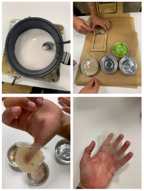
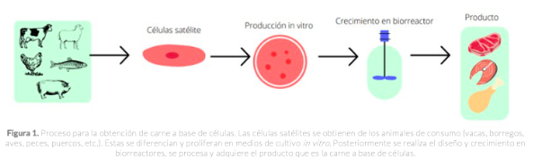

---
hide:
    - toc
---

# Bio - Agri Zero

# Experience

For two weeks we were learning about the theoretical bases of biology, along with learning about the planetary point of view, concepts such as the anthropocene, and the relevance of ecology and biodiversity. Along with that, the classes include field visits, where we could learn about the work in this matter from the space where it is created. In addition, each class had a series of exercises and experiments that helped us to apply and, and know physically the different theoretical learnings that we had.

For me, the experiment of making our own bioplastics was key to my learning. We carried out all the experiments in the same group and in general, at the beginning it was difficult for us to understand what to do and how to do it, mainly because all of us years ago were not familiar with this type of activity and we were not able to understand what we were doing. Over time we learned that our best strategy was to stop and think before we started mixing and executing actions.

That's what we did with the bioplastic preparation, which worked quite well for us as it was the right consistency and met the key criteria we needed to achieve. It was a pleasant experience of teamwork and execution.

On the other hand, the experiment itself seemed very interesting to me, since it allowed us to verify live that we are capable of making bioplastic, in a simple and methodical way, which opens the possibility for our projects to consider this variant, without seeing it as a extreme difficulty or that makes our project much more complicated. At the same time, it brings us closer to a production that is friendlier to the environment, since since they are not derived from petroleum (like plastics), they can biodegrade more easily.

# Cultured meat phenomenon

The food crisis, animal-borne diseases, the climate crisis and increased environmental conscience have led scientists to improve food productivity and yields using technology. In this way, different ventures focused on this market have been born, which seek through science to generate meat for consumption without sacrificing any animal. There are two types, one that is carried out through cell culture of animal cells and another that seeks to replicate animal proteins through other foods, such as mushrooms, legumes and other vegetables.

Figure 1 outlines in a simple way the process of cultured meat, which, as established by Faustman (2020), is not technically meat, since it corresponds to cultured muscle tissue, since it derives from muscle cells, and corresponds to a post-mortem biochemical product. .

On the other hand, genetic engineering has made it possible to create completely acellular meats, and therefore, 100% free of any animal origin, since it uses different protein architectures, which, when modified, allow animal replication.

The challenge of both technologies, as established by the news and the different papers, is to replicate the characteristics of the meat, managing to replicate the taste, smell, colors and textures in the most perfect way possible. To achieve this, a high investment in technology is required and also, as stable XX, more legislation is required to establish regulatory frameworks to stimulate this type of research.

# Reflection associated with the course

This case reflects part of what the course tried to convey to us, since they taught us about the structure of proteins and how they could be modified through genetic and scientific processes, and thus be more sustainable and efficient with the use of the resources. In turn, this allows linking a vision regarding the transformation that we would like to carry out in the world, together with scientific development, moving the barrier of knowledge hand in hand with a positive impact.

Now, a criticism that can be made is that this is a reactive solution, since it does not seek to change eating habits, but instead seeks to replace products. Probably, as is the case now, this type of cultured meat will also be inaccessible to people with fewer resources and will even cause people to consume even more meat, without considering dietary limitations or the benefit of these actions.

References

Grupo Prensa Digital (27 de septiembre 2022). La biotecnología cruelty free que revoluciona la industria alimentaria. Portal Innova. https://portalinnova.cl/la-biotecnologia-cruelty-free-que-revoluciona-la-industria-alimentaria/

Faustman C, Hamernik D, Looper M, Zinn SA (2020). Cell-based meat: the need to assess holistically. Journal of Animal Science, 98(8), skaa177. doi: 10.1093/jas/skaa177

Zúñiga Reynoso, G. V., Cruz Benítez, W. S., Mendoza Herrera, V., González Mendoza, N., Pérez Zavala, M. de L., Barboza Pérez, U. ., & Barboza Corona, J. E. (2021). Agricultura celular: produciendo alimentos y otros productos sin el uso de animales o plantas. JÓVENES EN LA CIENCIA, 10. Recuperado a partir de https://www.jovenesenlaciencia.ugto.mx/index.php/jovenesenlaciencia/article/view/3301

