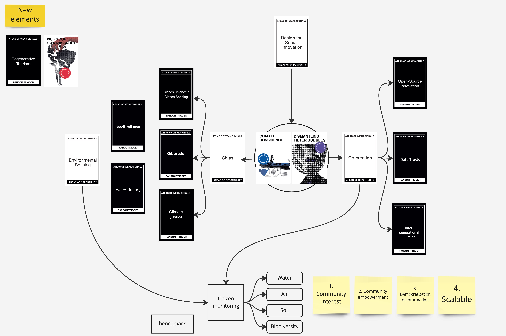

---
hide:
    - toc
---

# Atlas of Weak Signals

# Weak signals

After an interesting process of playing with the Atlas of Weak Signals cards, I chose two main weak signals: “Climate Conscience” and “Dismantling filter bubbles”. My reasons are connected with my previous experience as consultant of community relationship. In that role, I worked on a project where we needed to design a relationship between a community and a mining company. The problem was that the company produced a lot of dust, and that created a yellow cloud during the morning. This generates two different positions, in one hand the community claimed for the contamination, on the other hand, the company argues that the level of contamination is lower than the standard allowed by the government. What can we do with it?

My fight is to connect different points of view and create realities that consider all dimensions of the problem, not only one side, not just arguments that benefit us. In Chile (my country), and a big part of latin america, sacrifice areas are a common problem. A lot of communities have been permanently impaired by heavy environmental alterations, and most commonly exist in low-income and minority communities.

How can we change the way we understand territorial coexistence? How can we have more control over industries?

# Opportunities

The last few days I have been trying to think about different proxies to this problem, because I want to explore other topics. In my four years as consultant, impacts of the industry on communities and their environments have been common issues for me. Atlas of Weak Signals was a very important activity to think of new things, because that way I can make more creative proposals. In my first iteration with the cards, I had to connect “Carbon Neutral Lifestyle”, “Pick your own passport”, “Computational thinking”, “Sustainable leisure” and “Regenerative tourism”. After thinking a bit about each concept, I envisioned a green passport for tourists that measures the amount of pollution during your trip. Cool.

If we follow the same “current of thought” perhaps we can create a new passport to companies, different from the institutional environmental indicators, which consider the approval of the communities. Passing state requirements is minimal, considering community voice is mandatory. “Monitoreo Ciudadano”, is a challenge of governance and how communities, companies, and governments understand territorial coexistence.

I’m probably conceptualizing the problem wrong, but it’s a first approximation. Mariana helped me and connected me with different people who had worked on these types of issues before, and shared with me documents of a project about the impact of industries and the citizen voice.

Step by step

