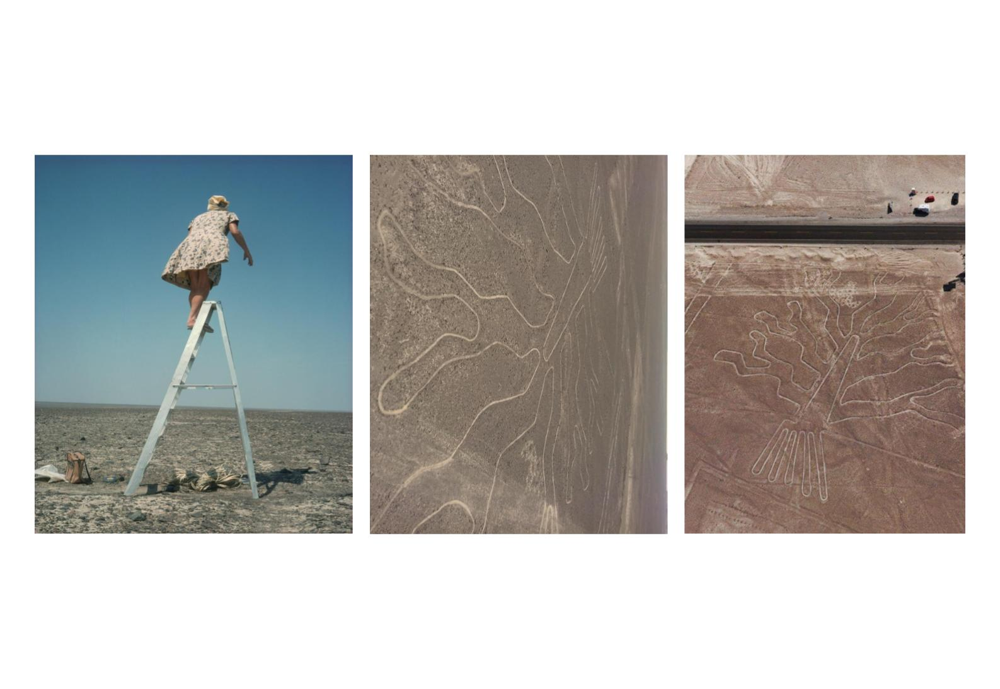

---
hide:
    - toc
---

# Designing for the Next Billion Seconds

## Reflections

On the final day we closed the course on the beach and I felt very identified with Clodi's words. The course for the first time made me have a positive perspective on the future. For my work I had to investigate trends associated with mental health and nowadays eco anxiety is an issue present in many young people. I believe that the course was a contribution in that sense, since it allowed me to learn about perspectives that invite you to be an active actor in society and design for a better future.

I am also grateful that it made me aware of many things that happen around me, such as how eclipsed I was by my smartphone. The professor proposed interesting exercises to question our routine and be more mindful of what we are doing.

Finally, I found the concept of degrowth very interesting. With the Colonizados Club (Latinos in the master's) we were discussing how many of the dimensions reviewed during the presentation could be reflected in our countries, and also how the first world often hides its impacts in countries like ours, which have all the externality of mining and production of raw materials.

## One day in 2052

My proposal was much more pessimistic than that of my peers. I was impressed that I did things much more down to earth, it showed that I am still not detached from my engineering mentality. I didn't think it’s bad, but it still surprised me.

<iframe src="https://docs.google.com/presentation/d/e/2PACX-1vQuhc7gS304Rj2MsEW4yhMRSDmjQjbaMZWcVj-wVk2TmSnKyCv-Nj7imllkfpdDiw/embed?start=false&loop=false&delayms=3000" frameborder="0" width="960" height="569" allowfullscreen="true" mozallowfullscreen="true" webkitallowfullscreen="true"></iframe>

## Letter for the future

Dear Ariel,

I am writing to tell you about some of the most surprising changes you could imagine. The COVID 19 pandemic was an era changer around the world, many people, communities and countries began to mutate, changing their leadership, their governance systems and their expectations of success. Despite the various power struggles that emerged, over the years humanity faced one challenge as a whole, the climate crisis. For some, the lack of water, extreme temperatures and loss of biodiversity were a community alarm, the COVID 19 pandemic was like a preventive lesson, we all knew that this problem went beyond borders or ideologies. This is how society realized that the only way to prosper was united. On the other hand, the risk to our ecosystem made us finally understand that we were not the only species on this planet, so technologies advanced in a way that allowed us to monitor, safeguard and regenerate the environment. At some point we feared a world war for water, however, the knowledge distributed thanks to the internet and collaborative scientific work, allowed us to find a solution to the problem jointly among countries, thus avoiding competition for the resource. Today we have new challenges, such as deepening our link with nature, so that our impact does not mean further deterioration. How will it end? I do not know, as in previous historical moments there are dichotomous positions, however I have faith that we will solve it.

Keep enjoying Barcelona, it will be your best years.

## Time capsule

<iframe src="https://docs.google.com/presentation/d/e/2PACX-1vRh-iCJGii6zHYRcIqGsjryyd88R9pQk-h5pSbr2NkLgoZpnZC-N77cgh8_q4E0TPQ89UbzRO5QHiaq/embed?start=false&loop=false&delayms=3000" frameborder="0" width="960" height="569" allowfullscreen="true" mozallowfullscreen="true" webkitallowfullscreen="true"></iframe>

