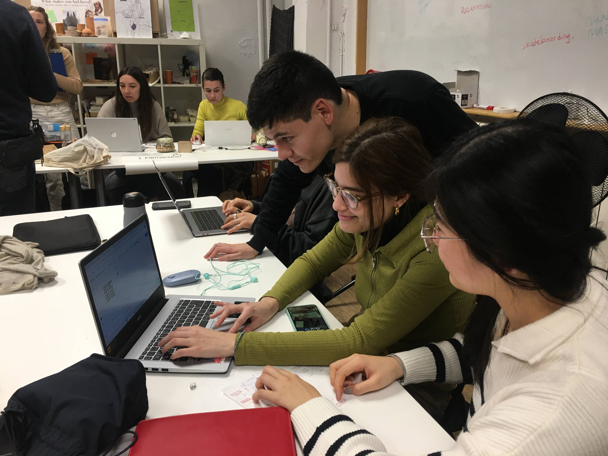
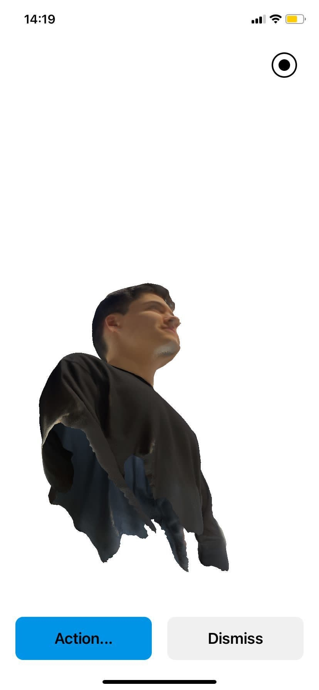
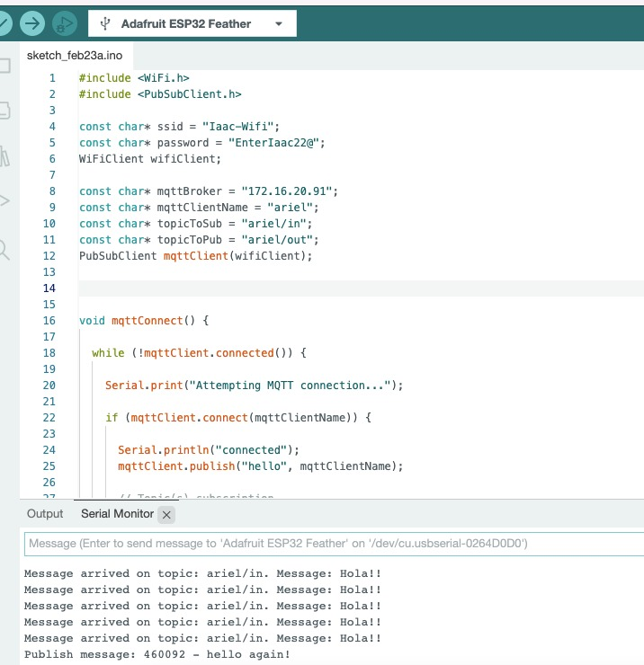

---
hide:
    - toc
---

# Prototyping for Design

## Week 1 - Class 1 - Introduction and Arduino exercise

In today's class, we had an introduction of what we are going to face during the next weeks. Now is the most maker stage of the program, it is certainly something challenging for me, at first it did not seem so attractive, but after my experiences doing interventions I have discovered a taste for leaving the theory and move to action. I also believe that what is relevant for my personal objectives is to share the learning I have achieved through the master's degree with others, not in a unidirectional way, but by devising new workshops and methodologies so that people can also reach the same conclusion but in an autonomous way.  

During the presentation, we had an introduction about technology and how we interact with it. My studies in engineering have allowed me to be super close to the problems associated with understanding technology, so part of the reflections we had during the presentation made a lot of sense to me. At the same time, despite the danger of new digital tools, I think they are a great contribution to the work of the person. From a social point of view, and away from the master, I think we have to manage to channel these changes in the various areas of impact, such as labor, educational and productive. In this dimension, design has a lot to do and maker culture has even more to do, since it can reduce the gap through tools that are easier to understand.

First challenge

The first challenge was to operate a speaker through arduino. We had done this before with my group, so it didn't have to be that difficult. I managed to get it to operate with extremely basic connections, thanks to a youtube tutorial, however the sounds were quite limited. I felt provoked by the different tunes my classmates were making, so I asked them to help me do it too.

The easiest was with Arduino Maker Uno, a different board that Wen had that she had used in a workshop with kids years ago. I followed the tutorial Marielle shared with me and we got to work.

There was a very complete list of songs, which made the exercise quite entertaining. It reminded me of the ringtones I had on my cell phone when I was in elementary school. I wanted to find more modern songs so maybe I could go viral on my social networks, however I didn't find anything, the most updated was an Ed Sheeran song that we found with Wen and Jime, but the melody wasn't that similar either.

Video:
<iframe src="https://drive.google.com/file/d/1iTtFWwbqGZDUTK6KsMg1KUnkTinCWPQe/preview" width="640" height="480" allow="autoplay"></iframe>

## Week 1 - Class 2 - Parameterization

This class reminded me a bit of what I learned in engineering, it was horrible flashbacks to Calculus 2 class, there I learned about graph and formula based parameterization, vectorization and linear algebra. I think because of this I in general it is easy to assimilate how the different tools work.

It was funny that my answer to Edu's exercise of parameterizing a croissant was a wolfram alpha function, where it is parameterized through two functions and limiting their solution space, through functions. I think that the most striking and important part of the learning is how all that abstract and complex content that I learned in engineering, now could make sense, since what I parameterize can be made real through 3D printers. I am not unaware of the learning I had in engineering, however many times the exercises were not very applied and far from what I might ever need. With FabAcademy at least I can focus on learning while still doing things that are useful for my master's work.

My croissant

# Parameterization exercise

As part of the work, we have to try different tools and understand how they work. As part of the exercise I reviewed the different tools that we saw on the class: grasshopper, fusion, opencads, fusion 360, blender and stable diffusion. I found the concept of Generative Design very interesting, so I wanted to try Fusion360. All the tools were new to me, so any that I wanted would be a considerable time investment.

I found out that my undergraduate university has an agreement with Fusion360, so I chose that software and started learning with this tutorial.

Then, I searched the internet for available renders created by other people, I was impressed by the large number of renders of weapons, it is worrying the fanaticism of some people for this type of devices that seek to generate harm to other people.

Guns

Idea of the work and initial hypothesis: after my interventions in schools, I would like to use what I learned in fablab to design a game in which children can improve their literacy on issues of environmental awareness and protection, as well as develop their leadership as activists in their environments.

Creative process: The first thing I did was to look for a rendering for the game, our idea is to make a game similar to "Ludo", the sketch I found was quite similar. My challenge was to design some of the game pieces. One of the findings of our workshop with the Sant Andreu School in Badalona, was the concern of the children about the trees in Barcelona, mainly because there are not many according to their point of view. For this reason one of the cards will be trees.

I started by creating cones to represent each level of the tree, then I duplicated them and resized them to simulate a cone. Finally I made the trunk and a base. It seems simple, but it was not, however it is to be expected, whenever you start using a new tool, you have a time of assimilation, which is basically an investment of time.

Creating cones

Duplicate cones and sizes changed

Tree without base

Final tree

Reflection about the process:
- There is a lot of material available on the internet to learn autonomously. Tutorials are the best way to learn and it is an easy way to do it.
- At the beginning it was difficult, but then it became more and more intuitive.
I need a mouse, it is impossible to work with the mousepad of the mac.
- There is a tremendous potential that can make my life easier, mainly because I don't like to work with physical tools, so designing through this way and then printing is something much more comfortable for me.

## Week 1 - Class 3 - Cutting on a laser machine

Cutting on a laser machine and 3D printing are some of the most useful things in recent times. During college some friends of mine started selling different objects made with pieces made on a laser cutter: lamps, key chains and furniture.

As part of the activity we had to use the laser cutting machine. Following our idea, my goal was to cut with the machine a figure of the possible game.

The first thing I did was to consult in different repositories where I could find a tree vector and I found one that was quite useful for me, which simulated a Christmas tree. After learning well how the cutter works and finding out with my colleagues, I prepared the files to cut.

tree in laser cutter

I had everything ready to cut on Thursday, however I had to leave because I had a prior commitment. I scheduled a time to use the cutter on Tuesday.

## Week 1 - Class 4 - Input and output

I think that human-machine interaction is one of the most interesting things we can learn in the master. As we learned in the seminar, there are different types of sensors. I was very interested in the ones that were associated with measurements of environmental elements. At the beginning I was very interested in what was being done with SmartCitizen, I wanted to use that technology in my project, but it could be very difficult, and probably I will need more time to do this, and with the time in class, tasks and personal work, it will be impossible. I was very interested in the monitoring of queality of air, because in my country, Chile, this is a huge problem.

For my project, I think that sensors can help to guide the activities I want to do with the children, or generate visualizations that allow to understand first conclusions and trends.

The challenge was to make a telegraph with arduino. I made the whole attempt, however, until Thursday I only managed to activate the lights with the button. It always happens to me with Arduino, that the simplest steps end up being very complex, generally for not following the instructions correctly. Everything related to electronics is a challenge, however I am very aware of how useful it can be for my project.

Then Toni provided me with his code and arduino to test it on my computer and try to move forward, however my changes only made me go backwards in the progress.

## First Micro Challenge

Working with Jimena and Wen is very comfortable, in general it is very easy for us to make decisions, which facilitates our work and allows us to move forward more quickly. The idea was different from the one I proposed, and we did not make a game, but a perception map, as a way to stimulate debate, the generation of new ideas and literacy on issues of climate crisis, mental health and gender equality.

I think our idea is quite useful for facilitating discussion processes and team building activities. Sharing points of view helps us to make our own blind spots visible.

Our structure based on: discussion of idea, planning and then execution was very useful to make the experience not so traumatic. Thanks to this activity I remembered how to use the laser cutter and imagine future uses for personal projects. Work with rhino designing the emoji tokens and cutting them on the machine. In the first iteration with cardboard Wen took the lead since she already knew how to use it and the second day with wood, Jimena and I made the cuts.

my team

The biggest difficulty was in the electronics, I was in charge of the board lights and because of a bad connection inside the board, our progress was stopped for a few hours. Much of the FabLab team was helping me with the problem, my led would light up when any object approached it, something much more complex than we needed. Then the problem was to connect all the pins to the arduino, the positive thing is that we were able to correct it fast.

<iframe src="https://drive.google.com/file/d/12tr7VCuyKRRafzAmV4nki7mt7R9APIFF/preview" width="640" height="480" allow="autoplay"></iframe>

In the next steps I would like to involve more technology, I saw in Clodi and Mari's project the use of an application that they created and people could interact with their device and at the same time with cell phones, I think that is a tremendous development opportunity for us.

Another improvement is to use sensors and lights to better guide the activity, for example as more people have an opinion the square could be illuminated or instead of having LEDs we could have a series of lights that change color according to the gradient.

Things I learned:
- Even though you are trying something very simple with Arduino, this can get complicated. You have to be neat and follow each step.
- Using rhino and laser cutting. How to regulate each of the parameters to avoid burning the wood and affecting the aesthetics of our project.
- The importance of documenting the process permanently and not at the end of the process. I learned this from Wen and Jime, both have this work methodology, which makes it much easier, since we can consult the steps and not lose focus on what we are doing.

You can review our process in detail on this page:
https://github.com/wenqianchua/microchallenge-01

## Week 2 - Class 5 - 3D

Eduardo taught us about 3D scanning and 3D printing techniques in a way to visualize new value propose for our personal projects. I have previously worked with 3D printing, however with very specific uses, without the opportunity to explore freely.

The first exercise I did was scanning. With Marc's help the first thing I did was to scan myself, it didn't turn out so well, as the accuracy we had was not good.

Later, what I did was to scan the Moai that is in the FabLab office, I found it a nice souvenir, because the Moai is a very characteristic element of Chile. To scan it I used a device that rotated the element I wanted to scan. All this made my scanning process easier, which allowed me to have a much more finished file.

At my university in Chile I had been taught not to print in solid 3D, but only with a few layers, in a way to save material. Since I was exploring and the use of my Moai was nothing more than experimental, my project only considered 3 surface layers.

<iframe src="https://drive.google.com/file/d/1ti-L4h7NgbKEJGKcK7u2_3NVsNMIOECi/view?usp=sharing" width="640" height="480" allow="autoplay"></iframe>

After 2 hours, I got my Moai 3D printed. The satisfaction of creating and seeing a project materialize is fantastic, it makes me feel somehow like a craftsman.

## Week 2 - Class 6  

Today Victor taught us about the Internet and its role in the democratization of information and communication. No doubt it is necessary to make conscious use, since everything we do is recorded. This class was different, because unlike the previous ones, we were not left with an assignment, but rather applied learning during the class. This methodology is much more stimulating and less tedious than the other classes. I am very grateful to Victor. At the same time, the fact that we are all working together generates a much more rewarding collective learning dynamic.

As part of the task we had to connect arduino to wifi and communicate among the different participants in the same space. I worked with Jimena, although Victor asked us to make groups, each one preferred to work on his computer in a way to learn and not leave the work alone to one person.

At the beginning we had problems with the IP address, which had nothing to do with the code we were doing, so Victor worked on that until it was fixed. With the code working and after downloading the PubSubClient library, we created the channel called "Ariel". It was a profitable and successful learning process, I enjoyed it and I will keep in mind how to take advantage of it in the future.

## Week 2 - Class 7

In this class we learned to give new uses to MQTT servers, this time what we did was to synchronize all the arduinos in the class and coordinate them so that if someone activated the candle mode or flicker mode, all the lights would make those changes. Again I was pleasantly surprised with the class, mainly because I felt it was useful, since I learned in the moment and in a collaborative way.

<iframe src="https://drive.google.com/file/d/14zFXIPnzJ8Pyq9Gklk5t2HqoQVkzJ-le/view?usp=sharing" width="640" height="480" allow="autoplay"></iframe>

## Week 3 - Class 8

Eduardo taught us how to use the CNC machine and opened up a world of possibilities associated with creating furniture. I spent a lot of time searching the internet for projects and ideas about what we could do. Edu told us that each person was assigned an amount of material, however we talked with my group and we all agreed that we could use the material for our group project and in this way not waste the material. Our idea is to make a table of an optimal size to be able to leave our perception map.
