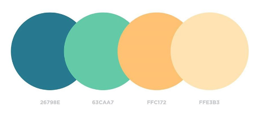
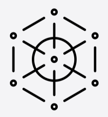
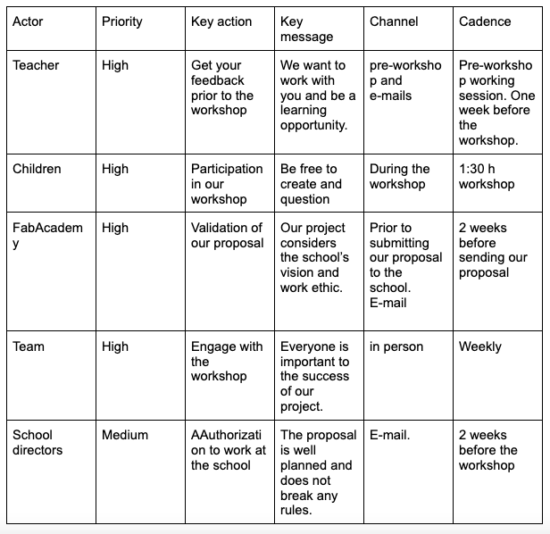

---
hide:
    - toc
---

# Communicating Ideas

The first class was extremely interesting, when I see applications for my work life the master becomes much more interesting. Kate's class allowed me to be updated on communication challenges, new trends and emerging tensions, key elements to consider when starting a communication or engagement process with other actors and stakeholders.

As part of the assignment, we had to define our purpose, mission, brand kit and a MVM.

#Definitions

Propose -
Participation is the strategy to make our blind spots visible and build futures that are friendly and respectful to all stakeholders in the ecosystem.

Mission -
Design friendly, scalable and high impact futures through innovative participatory methodologies.

Vision -
Create collective development goals through citizen priorities.

#Personal brand

Colours

I chose a sober color palette, where it is not easy to notice hierarchies. I liked it because I believe that these colors represent balance, care, simplicity.

Font

Gill Sans: I chose this font because it is simple and sophisticated.

Icon

Values

- Honesty
- Critical thinking
- Horizontality
- Perspective

# Pitch

I am creating futures associated with the care of the environment through the visions of children, to propose a new design framing, and thus create products, services or experiences that meet their expectations.

# Actors

By recreating the exercise we were taught in class to identify our main stakeholders, I realized what we needed from each of our stakeholders in order to successfully carry out our workshop. This will make it easier to be more assertive and effective, avoiding diluting the conversations. I also realized how necessary it is to maintain communications with both IAAC and school teachers, as they are the ones who will authorize us to enter the schools.

