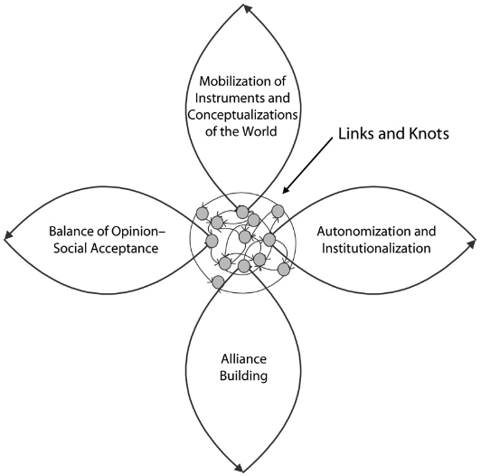

---
hide:
    - toc
---

# Making Sense and Meaning

Reconfigure systems

Life as we know it can't go on much longer. Although we hear more and more about the importance of "sustainability," the reality is that there is no room for sustainability if we continue to do business as usual. Sustainability means "preserving, protecting and conserving current and future natural resources". So can we imagine a sustainable world? Kevin Slavin makes visible all that this current system means: rising temperatures, climate instability, species extinction. All this makes our world an unsustainable world.

As the author states, the capitalist system has defined the frameworks in which production and economy develops around the world. Under this logic, we humans are the center of everything, where most of the natural resources are at our service. This is how we have used minerals, water, air, soil to achieve our economic and welfare objectives. Although some countries are increasingly moving away from this logic, there are still a large number of nations where the indiscriminate use of nature defines their financial and employability matrices. Abolishing this type of industry is not entirely simple, since if we want a more environmentally responsible development we require, for example, metals that allow us to make this transition. This is the case of copper and lithium, which are necessary for the construction of electric cars and ecological batteries.

So we have the following dilemma: we need to stop environmental deterioration but at the same time we still require natural sources and the current system to solve this dilemma is not the solution. How can we do it? I believe that design is the answer. Through design we can create new materials, new ways of extraction and new palliative strategies for the negative effects of our development. We must move to a logic of regenerative design, that is, design that is capable of regenerating the damage that has been caused. Today it is not enough to neutralize the effects, but we must find a way for our actions to improve the initial conditions. It is the perspective of regenerative design that is best suited to address the challenges ahead.

In turn, a perspective to leave behind is anthropocentrism and the "user-centered" logic. Both elements respond to a capitalist logic that has deteriorated our environment and has made us lose sight of the full impact of our actions, reducing the success or objective purely to the approval or preference of consumers. To stop paying attention to this ideology will allow us to become aware of the environment that surrounds the products, services and experiences we design, without disregarding other actors in the context. Today more than ever, design must incorporate a point of view based on theories of networked actants, such as the one proposed by the author Bruno Latour. Without these elements design will be nothing more than the repetition of patterns that move away from real transformation. “Rather, they understand themselves to be participants, shaping the systems that interact with other forces, ideas, events and other designers”(Patel and Moore, 2017).

The power of today

Today we have the opportunity to create new worlds through technology and the dozens of wastes we have generated throughout our history. The future of the world is associated with logics of reducing emissions, waste and new ways of building. Thanks to Chat GPT some of the worlds we can build thanks to technology are:
1. Sustainable buildings: designers can use various software tools to optimize the energy efficiency of buildings, such as energy simulation software, building information modeling (BIM) software and sustainable design tools.
2. Green cities: Urban planners can use GIS software and urban design tools to create sustainable and environmentally friendly cities. This includes designing green spaces, promoting alternative modes of transportation, and reducing the carbon footprint of buildings.
3. Renewable energy systems: Engineers can use simulation tools to design renewable energy systems, such as solar panels, wind turbines and geothermal systems.
4. Green products: Product designers can use sustainable design principles and tools to create green products that reduce waste and promote sustainability.
5. Sustainable agriculture: Agricultural scientists and farmers can use precision farming tools and soil sensors to optimize crop yields and reduce waste.
6. Circular economies: Economists and business leaders can use systems thinking tools to design circular economies that promote sustainable practices, reduce waste and foster a more sustainable future.

This creative exercise allows us to visualize the potential of the different tools available to us and how through professional training we can refine techniques, innovate tools and manage environmental impacts differently.

Transition

The transition to these worlds must be carried out horizontally, that is to say, it must include technical and lay knowledge, under a strategy that allows the use of technological development hand in hand with local knowledge regarding environmental and cultural dimensions. Often, design and engineering approach challenges with an academic logic that does not address local concerns or realities, which causes products, services or experiences to be out of place.

The transition should consider local empowerment in a way that the people themselves are active agents of a production with less impact, where concepts such as regenerative design are not encapsulated in contexts of technical expertise. The future considers the action of all agents in the system, recognizing themselves as mere participants in an environment in which they interact with non-human beings, which must be respected and protected.

To achieve this, a series of definitions will be required to ensure the objective. According to what I have learned in Community Engagement and my experience working as a citizen engagement consultant, some important points are

1. Define the concepts: a central element is to agree on what we understand by a regenerative world and what are the objectives we want to achieve. The different actors: local governments, companies, collectives and individuals will have specific objectives that must be realistic and measurable.
2. Planning: planning allows mapping which tasks are necessary to achieve the objectives and coordinating each task as an understanding of the steps that will enable the new world.
3. Areas of work: defining which are the priority areas of work, such as energy, food, waste, water or transportation, will allow to focus the work on those areas of greatest interest and impact.
4. Engage stakeholders: a transition requires the participation of various stakeholders, so different levels of participation should be considered in order to respond to the needs of each stakeholder. For example: inform, ask questions, execute a partnership, collaborate.
5. Evaluate: permanent monitoring of the work allows us to know how the different strategies applied are having an impact. This is important to be able to make modifications during the execution of the different plans. In this way, avoid generating undesired effects and direct resources in search of a more significant impact from a regenerative point of view.
6. Co-create: Always consider the validation of people's opinion in a way that their voice is considered at all stages of execution. In turn, devise new ways to obtain feedback from stakeholders other than humans.

Conclusion

New worlds can be created if we stop thinking purely in terms of reducing negative impacts and move on to a logic oriented to the capacity of systems to generate positive effects on the environment. Metaphorically, the ideal would be for each actor to function as a large plant that consumes natural resources, but delivers others, allowing everything to continue functioning in a natural and friendly way. As a society we are tremendously challenged, because although we agree on where we should develop, we still cannot completely get rid of natural resources that are non-renewable. However, one thing we can change is the impact of the technologies or uses we make of these non-renewable resources.

We must also be alert to opportunistic concepts that only seek to disguise the effect of industries on the environment. For example, terms such as sustainable mining, paper mills against forest fires, among others, are examples of organizations that want to reconceptualize their business under fashionable slogans, disturbing the understanding of citizens. This is why an informed and empowered society is required, since public and international organizations have not been able to stop this type of practices.  

Innovation and investment are critical to the transition to a sustainable world. Governments and businesses must invest in research and development of new technologies, products, and services that support sustainability. Without such efforts, all actions will be reduced to robust countries and communities with the capacity to generate efficient systems. However, those communities that are generally the most affected by the climate crisis and its consequences will be left behind.  Without this understanding, the "backyard" logic will continue, where leading countries care about their environment, but send their waste and impacts to other countries with fewer resources.

Shifting society's mindset towards a more holistic and collaborative perspective is an advantage of regenerative design, as it values and respects biodiversity and natural resources. In addition, it can improve the quality of life of communities by providing healthier and more environmentally friendly solutions. This is why it is proposed as an alternative to build the new worlds we need as a society.

