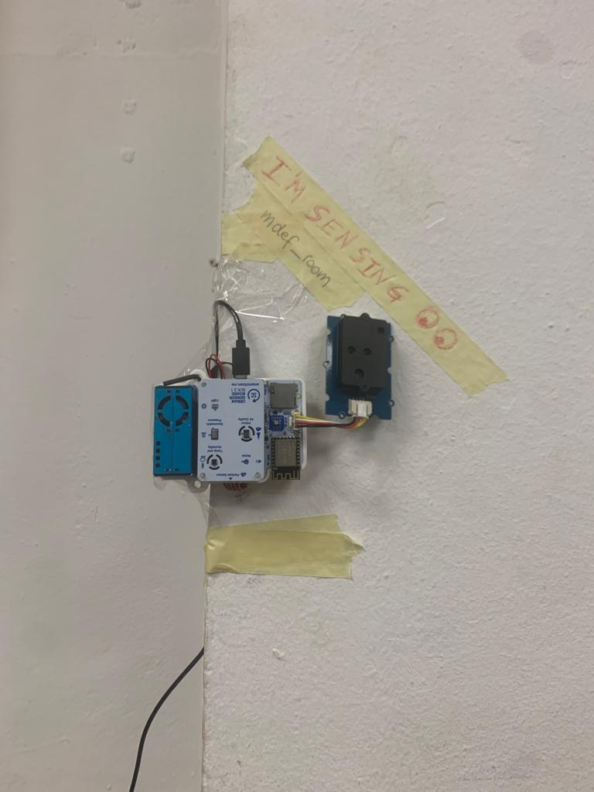

---
hide:
    - toc
---

# Measuring the world

This week was very motivating for me as we learned how data can inform and empower. I couldn't help but remember the project that motivated me the most when I was researching the master before applying: Smart Citizen. The democratization of data through that project could generate a huge impact on communities. I think this is a project with a lot of scalability. In Chile, communities living near different extractive companies have problems monitoring the environment and how much damage these industries are doing. A few years ago I worked on air quality in a town near a mining commune, where our challenge was to articulate citizen monitoring, Smart Citizen would have been a very good response.

At the same time, the efforts being made by various local governments to make available the data collected on the quality of the environment enables students like us to create new tools, so that we can be effective monitors. There is a lot to learn and then apply to Latin America, where the negative effects of companies have deteriorated the quality of air, water, biodiversity and soil.

Part of these reflections I shared with Matías Verderau when we met to talk about the project, since one of the first research activities was to watch the Smart Citizen documentary, and to see its effects in Plaza del Sol in Gracia.

Despite not being able to be an active actor, as I would have liked, during that week, due to personal problems, the project of measuring the indicators of our classroom was the most interesting. Despite the results, many of us complained about the lack of air and natural light in our work space, and also how it exhausts us and does not stimulate us to be creative. It is interesting to see the scalability of this type of devices, since this same technology can be applied to other contexts and environments.

