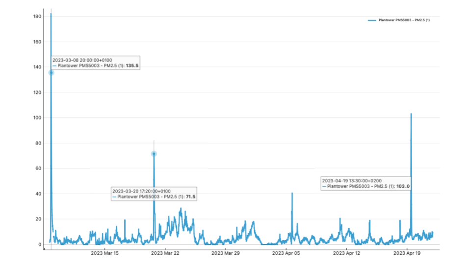
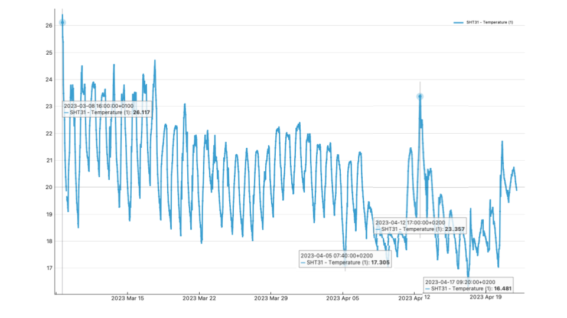
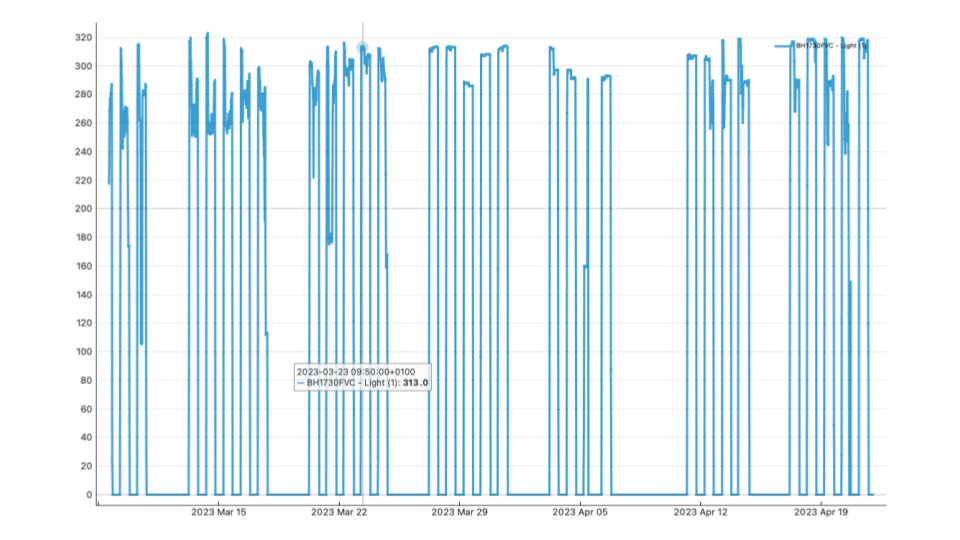
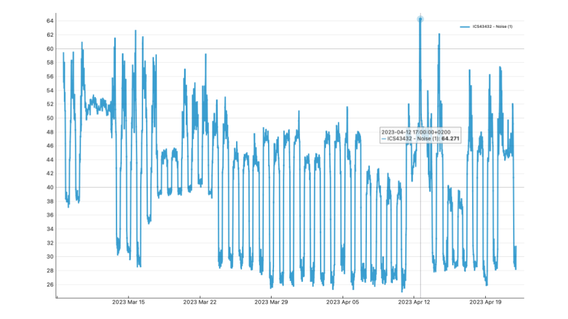
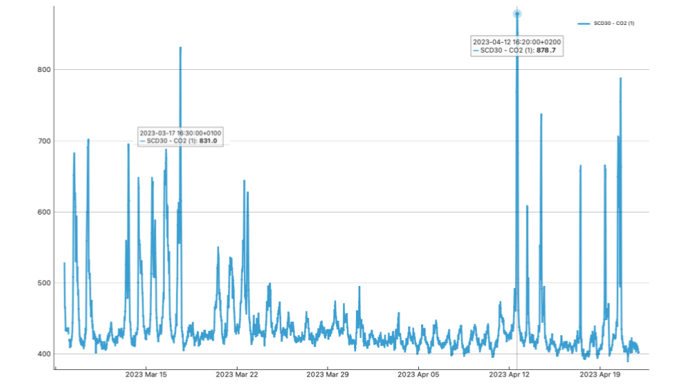

---
hide:
    - toc
---

# Measuring the world

This week was very motivating for me as we learned how data can inform and empower. I couldn't help but remember the project that motivated me the most when I was researching the master before applying: Smart Citizen. The democratization of data through that project could generate a huge impact on communities. I think this is a project with a lot of scalability. In Chile, communities living near different extractive companies have problems monitoring the environment and how much damage these industries are doing. A few years ago I worked on air quality in a town near a mining commune, where our challenge was to articulate citizen monitoring, Smart Citizen would have been a very good response.

At the same time, the efforts being made by various local governments to make available the data collected on the quality of the environment enables students like us to create new tools, so that we can be effective monitors. There is a lot to learn and then apply to Latin America, where the negative effects of companies have deteriorated the quality of air, water, biodiversity and soil.

Part of these reflections I shared with Matías Verderau when we met to talk about the project, since one of the first research activities was to watch the Smart Citizen documentary, and to see its effects in Plaza del Sol in Gracia.

Despite not being able to be an active actor, as I would have liked, during that week, due to personal problems, the project of measuring the indicators of our classroom was the most interesting. Despite the results, many of us complained about the lack of air and natural light in our work space, and also how it exhausts us and does not stimulate us to be creative. It is interesting to see the scalability of this type of devices, since this same technology can be applied to other contexts and environments.

## Update

After the group presentation, the smart citizens kept taking data from March 8th to April 22nd. With this increased amount of data, it becomes interesting to analyze some results regarding the environmental quality of our classroom.

Remembering, the goal of the exercise was the following:

hypothesis in a sentence:

The MDEF classroom has poor ventilation, air quality, natural light levels, and noise quality.

null hypothesis in a sentence:

The MDEF classroom environment is optimal for learning.

The main limitation we had during the development of the exercise was that we did not have enough data to be able to conclude conclusively whether our hypothesis was fulfilled or not. However, now with the new data collected, we can answer the questions more robustly.

## Analysis by dimension

# Air

The amount of particulate matter in the air can degrade air quality and have negative health effects. PM 2.5 represents the smallest particles, and PM10 represents the largest particles. The recommended value for study rooms is 15 ug/m3.

The days with the highest levels were

08/03 20:00 / Hypothesis: higher level since we installed it on that day.
20/03 17:20 / Hypothesis: that day there were no classes, but they may have been cleaned or someone worked there.
19/04 13:30 / Hypothesis: that day we had a prototyping for design class that ended at 14:00, maybe the movement of us raised the parameters.

Since the recommended limit was never exceeded. It is concluded that MDEF has an optimal PM 2.5 quality.

# Temperature

The results were:

Lower temperature
17º C 05/04 07:40 / Hypothesis: There was nobody in the room and it was one of the coldest days in BCN. Min: 9ºC
16ºC 17/04 09:20 / Hypothesis: There was nobody in the room and it was one of the coldest days in BCN. Min: 9ºC

Highest temperature
26.1ºC 08/03 16:00 / Hypothesis: our manipulation of the smart citizen may have increased the temperature. That day the temperature in BCN was: Max 22ºC Min 9ºC
23.4ºC 12/04 17:00 Hypothesis: At that time we were in a workshop of the Distributed Design seminar in the classroom. That day the temperature in BCN was: Max 20ºC Min 11ºC.

The maximum temperature for an educational context is 26ºC, so MDEF would meet the criteria.

# Light

The recommended artificial light value for study rooms is between 300 to 1000 lux

No day the measurement exceeds 320 lux, which makes sense given the architecture of the classroom. It is interesting to corroborate that the sensor is working correctly, since it does not detect light during the night and detects lower intensity at times when we probably turn off certain lights to watch a video during class.

Since the levels were always below 1000 lux, the room meets healthy standards.

# Noise

The highest noise level was detected on 12/04 at 17:00 of 64 dB, as I mentioned before, that day we had a group activity for the Distributed Design seminar, probably that made the noise levels increase.

The recommended dBA limit value for study rooms is 35 dBA. Most days this limit was exceeded. Probably the standard we used previously corresponded to concentrated study spaces, but the MDEF methodology is different, since it encourages interaction and teamwork. Considering the healthy noise level standards, the WHO declares a maximum of 70 dB. This level was never exceeded during the measurement.

# CO2

Finally the CO2 level, which may be related to the ventilation of the room. The highest levels were recorded on 17/03 at 16:30 with 831 ppm and on 12/04 at 16:20 with 878 ppm. On 3/17 we had the Challenge presentations, which could justify the large amount of CO2, while on 4/12 we had the Distributed Design seminar. Since the maximum recommended level is 1000 ppm, the MDEF classroom meets the standards.

# Conclusions

1. The MDEF classroom meets all environmental standards to be a healthy space, from a technical point of view.
2. All hypotheses are not true. The MDEF classroom doesn't have poor ventilation, air quality, natural light levels, and noise quality.

Despite these conclusions drawn from the data, it is important to note that the "healthiness" of the classroom is not only related to technical data obtained from measurements. An educational environment must integrate other elements that positively stimulate learning, such as natural light and fresh air.

These elements in turn influence the mental health of the students, as they reduce the stress and exhaustion due to permanent exposure to artifactual conditions, such as artificial light and air conditioning.

The recommendation is to try to get out of the classroom as much as possible, to stimulate interaction with more natural environments. This measure can influence students' motivation, participation and happiness during learning.
