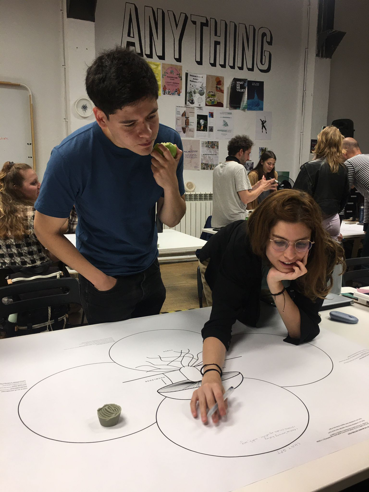

---
hide:
    - toc
---

# Distributed Design

Distributed Design is a seminar where I learned new methodologies and frameworks to approach a problem. Personally, my experience as an engineer and public relations consultant, the systematization and conceptualization tools are extremely valuable, as it allows me to frame the problems and be able to decompose each of its parts. The attractive part of the approach we learned were the new dimensions associated with regenerative design and the concern for the installation of capabilities in clients/users, as a way to transmit and give potential to what we do.

## Day 1

The first day we were confronted with the Mushroom Model, when the teachers presented it to us, the doubt that remained was how it could be applied to a service. Personally, I am not interested in working on product design, but more on services or experiences, so for the applied exercise I proposed to work on Chat GPT. Although it is still a kind of "product" since you can work on the UX/UI, you can also think of Chat GPT as an information system style service.

Which skills did I need during the activity and how can I translate into something useful for me and my future?

Since Chat GPT is not a physical product (beyond the web interface) I think the skill I needed the most was conceptualization, since we knew many things about how the tool works and its social consequences, but we didn't know how to typify them in a name. The dimensions of the model (making / power / value / knowledge) required us to be able to discern and categorize effectively. For example, recognizing the need to have good universities in order to have highly qualified IA professionals was a knowledge and making issue that we spent a long time trying to conceptualize, so that it would be consistent with our systematization. I think this will be very useful in the future, because more and more we are facing "wicked problems" where the problems and solutions we design are facing multidimensional issues, so knowing how to typify, conceptualize and classify them is the most effective way to manage and integrate them into the design.

How was the dynamic inside the group?

At the beginning I felt that what was most difficult was how to translate everything we knew about Chat GPT into a model that is easier to use for physical products. However, the dynamic started to flow much better when we started to disintegrate each of the topics that came to mind. I'm not sure if we did a good job, but there were super enriching conversations, where we were able to locate all the controversies associated with Chat GPT. That despite showing itself as an "Open AI" actually has a lot of barriers to entry for other people to develop something like this. I think I learned a lot from this experience.

Did the role I played influence my opinion?

My contribution was to mention dimensions associated with the economics and engineering operation of Chat GPT, taking advantage of my knowledge as a former public relations consultant and engineer, which was very useful because it opened up conversations regarding political power, technology gaps and potential ethical risks of the tool. This allowed me to add different perspectives from my colleagues, which materialized in what we wrote in the mushroom model.

## Day 2
The second day we worked on the Reflection Tree as a group with Wen and Jime, since we have the same project. The interesting thing was to submit our idea to a new board with dimensions that we had never questioned before, for example, everything that had to do with environmental regeneration. Environmental regeneration was our lowest point and something that we are going to integrate in our final product. It was a very good insight to be able to identify this improvement, as it gives us practical lights on where to go with our project.

<iframe width="768" height="432" src="https://miro.com/app/embed/uXjVMURNReQ=/?pres=1&frameId=3458764551541391901&embedId=992964804879" frameborder="0" scrolling="no" allow="fullscreen; clipboard-read; clipboard-write" allowfullscreen></iframe>

Which skills did I need during the activity and how can I translate into something useful for me and my future?

Since the Reflection Tree canvas had many dimensions that we did not understand, we had to use our research and interpretation skills to be able to answer each of the dimensions. In turn, that interpretation had to be able to be located in the context of our project. We had to recognize what the blind spots were in our project and look for references on how to address them. I think there are two very useful things for the future, the first is the tool, since any tool that allows us to recognize our blind spots is extremely useful to strengthen our products and secondly learning to perform a good benchmark, because every time we set a challenge is extremely useful to know what is the state of the market / area as a way of not reinventing the wheel.

How was the dynamic inside the group?

The dynamics of working together with Jime and Wen are very good. We have been working together since the first quarter so we are already able to recognize each other's value and skills, so in general the whole order development works quite well.

Did the role I played influence my opinion?

Yes, listening to the feedback that the teachers gave us helped me to identify new dimensions in my project that I had not considered. As we were working in the field of social innovation, we had abandoned everything related to the environment. At the same time, Marc gave us ideas on how we could empower teachers to use our perception board, which was very accurate considering the objectives proposed by the methodologies associated with Distributed Design.

## Day 3

During day 3 we had to discuss about our values and make a group with those who shared the same value and analyze how we put it into practice in our projects. In a much more reflective way we were able to be able to capture what collaboration was for us.

<iframe src="https://docs.google.com/presentation/d/e/2PACX-1vRxXzs6f6dncoyUcmrzHUOU9BWQY7rgm89IfOl1Tlj5hg7OOtC_FndbxLFlWXYY8Xp6_ytNUhgOIUvf/embed?start=false&loop=false&delayms=3000" frameborder="0" width="960" height="569" allowfullscreen="true" mozallowfullscreen="true" webkitallowfullscreen="true"></iframe>

Which skills did I need during the activity and how can I translate into something useful for me and my future?

I developed the soft skill of listening, since we had to address this discussion I took advantage of listening and being able to connect with the motivations of my colleagues. I had never worked with Ahmed, Caglar or Ramiro, so it was interesting to understand what they understood by collaboration in their particular contexts. What stands out the most is the inter-species collaboration, which was one of Ramiro's pillars, as it gave a new framing to something that we generally understand very much between humans (collaborating between people).

How was the dynamic inside the group?

I think the dynamics did not flow in a profitable way. Personally I found it difficult to approach teamwork. Used to working with Wen and Jime, who in general are more oriented to execution and application of methodologies, I came across a style of work that I did not understand and after a few minutes where nothing was being done, I took a ppt and started to execute an exercise where I could get the point of view of the others in a simpler way, since the conversation was not flowing.

Did the role I played influence my opinion?

Within the activity I contributed my point of view and a way of approaching the exercise, however I think it was not effective. I did not feel comfortable and at the time of presenting people noticed the lack of reflection and conversation we had. My positive thought is that at least we were able to propose something and break down a definition to build our own.
