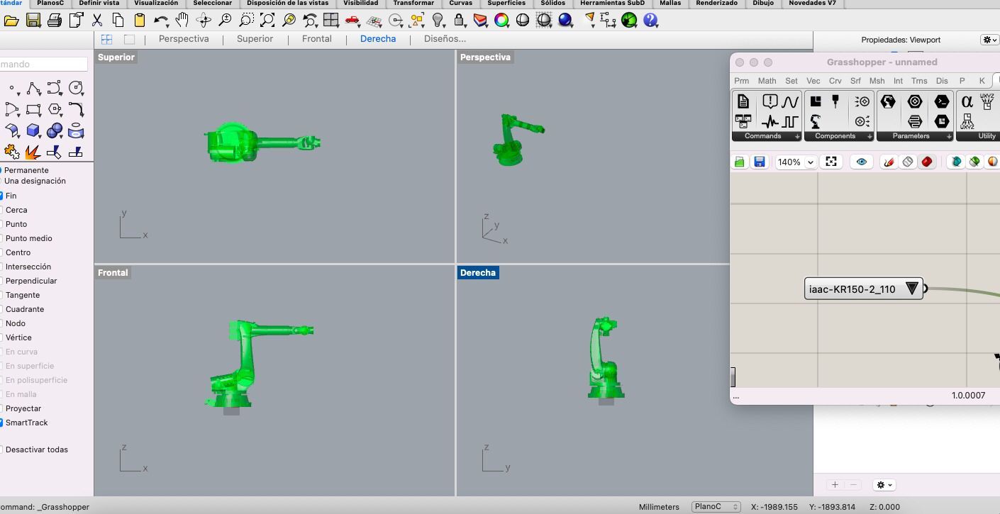
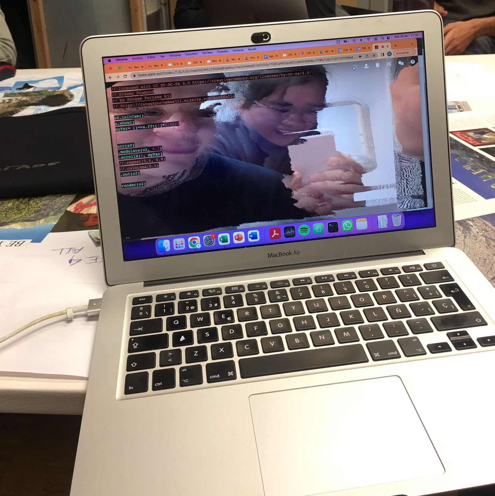
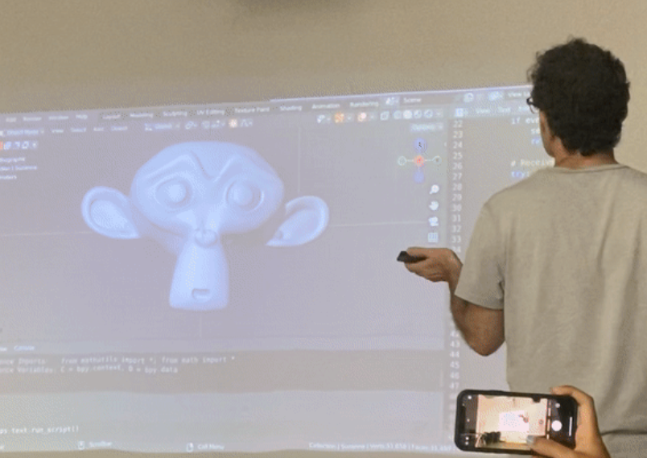

---
hide:
    - toc
---

# Prototyping for Design

## Task 9 - Wildcard week Robots

This week we learned about the robotic arm and had the opportunity to use it. One of the most relevant things for me this week was learning about the existence of this tool. As Josep explained to us, the robotic arm has many uses that can make our lives easier. First of all, the precision it has allows us to assemble things, assemble microchips, position things in very specific spaces. At the same time, it has the strength to move and carry things, which allows us to surpass human capabilities.

Finally, we went to the other IAAC site to use the robotic arm. I had the opportunity to control it, however I lacked much more confidence in my movements and more understanding of how to control speeds, angles and directions, as I did not meet the goal I wanted to achieve with the machine (go through the middle of an adhesive tape).

Within the week's work we also used the parametric modeling tool Grasshoper. The truth is that I could not do much because my computer had no memory, but I could understand how the system behind the tool works. Seeing actions, functions and their specifications.

Finally, we went to the other IAAC site to use the robotic arm. I had the opportunity to control it, however I lacked much more confidence in my movements and more understanding of how to control speeds, angles and directions, as I did not meet the goal I wanted to achieve with the machine (go through the middle of an adhesive tape).

## Task 10 - Blender

In this class Victor introduced us to Blender. I think the most relevant thing was the critical point of view that Victor has about the software and the use we give to it. I think this kind of classes teach us much more than the tool itself, because due to the characteristics of the environment in which we have grown up, probably we have all learned to use a program independently, without the need of having to have a teacher, just a tutorial and knowing how to search the internet. However, the critical vision that Victor transmits allows us to question ourselves more about what we are doing, if what we are designing or assembling in a software is something we really wanted to do or we just let ourselves get carried away by the recommendations/limitations of the software. I think this is a very valuable learning that can be applied to many aspects of life.

## Task 11 - Human interfaces

This week we used https://hydra.ojack.xyz/ to learn live coding. I think it is a tremendous tool to introduce the world of programming to kids or people who have never done it. It reminds me a lot of Google - Grasshopper, as once for a workshop with kids we used it and it worked very well, since as the kids programmed you could see the progress. I had fun playing, changing parameters and imagining possible uses of the tool in the context of Big Little Futures, the project we are running with the Badalona School.

## Task 12 - Blender Interfaces

In this seminar we learned about Blender, its uses and the modifications we can achieve using python. Victor taught us how to "hack it" which is very interesting because it opens a wide range of possibilities about what we can do.

During the class we modeled the face of a monkey, making different changes to learn the functionalities of Blender. The most interesting exercise was when Victor controlled an animation with the movement of his phone. The world of digital animation has been close to me, since a friend has always wanted to work at Pixar and has been specializing to achieve it, however, despite the fact that I knew from the theoretical, Victor's exhibition allowed me to know in more depth what happens behind and how we can extrapolate it.

A second example was the LED movement with Blender and Arduino. This reminded me of a project that won a sports innovation contest, it consisted of a led rope that turned on with the same speed as a professional swimmer. In this way, Olympic swimmers could know their level in reference to Michael Phelps for example. It could also be programmed with your own times. In this way, the swimmer and his coach could improve themselves.

If we add to all this that it is open source software, which is easily integrated into Python and Arduino, it gives us many possibilities to use it in our interventions. It would bring an interactive, technological and creative character to our projects.

Screenshot of Marc's video

## Challenge final

During the final challenge we were asked to create an interface. For us it was difficult at first, because Santi and Victor wanted to know the reason for our proposal, which was complex to answer because the truth was that we were doing it only because they asked us to, but until that moment we did not find that it added value to what we were going to do in the MDEF Fest.

After some more thought, what we made was a futures collector, which allowed us to collect with images the futures that the children were dreaming about. This way it was going to be much easier to generate conversations about that future and also stimulate creativity.

From a technical point of view, much of what we did was achieved thanks to Chat GPT, I think as a group we learned the skill of how to be accurate in asking the IA and recognizing the potential benefits to improve our project. At the same time, through the queries we made to the platform, we were able to understand what it was doing.

As next steps we want to be able to host the platform designed online, so that anyone can access it from their device. We also want that when the person chooses his or her future, it will be saved in a notebook, so that we can collect the futures of all the children in a simpler way.

HackMD:
https://github.com/jimenasalinasgroppo/microchallenge-02
