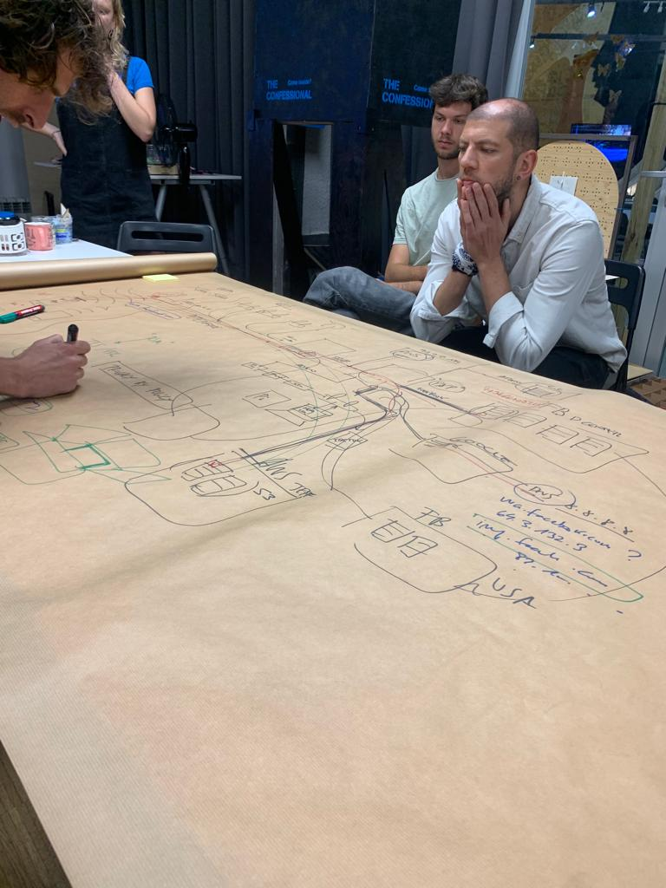

---
hide:
    - toc
---

# Decentralized Autonomous Organizations

In this seminar we learned about the role of design in the world of technology, and how digital devices are often centralized and unconsciously perpetuate bias or discrimination. One of the main conclusions I drew from this seminar was that design, as a practice, is political. It is not trivial design decisions, for example in UX issues of an application. Many times we tend to bias behaviors, we encourage practices that are harmful to mental health or we may be punishing businesses just for wanting to do things differently.

Maybe all these things were not direct expressions of Guillem, but they were personal reflections. The netflix documentary, Social Dilemma, came to mind, where we could see how advertising influenced politics, encouraged fake news and allowed hate speech towards minorities. I also remembered everything associated with the reputation economy, such as the millions of Uber drivers who have an app or algorithm as their boss, without labor rights and basic social security.

As a final part of the first session, to open our eyes, Guillen did a reverse engineering exercise, in order to understand the physical and digital ecosystem behind our online actions. This reminded me of the communities harmed by these industries. A few years ago I was involved in analyzing the impact of data centers on the water flows of the communities near them. This infrastructure needs a large amount of water to cool the computers that store the information that is in "the cloud", which has effects on the availability of water for agriculture, biodiversity and the natural flow of the resource.

During the next session we reviewed different projects related to open protocols and the use of design justice principles. For me it was very useful to know these principles and references, because at the time of implementing a similar project I can use these cases as an example. Particularly, it caught my attention, since they talk about the role of the designer as an articulator of a new reality. Personally my fight at the beginning of the master was to be specifically that, an articulator able to find solutions to wicked problems between different disciplines, such as engineering, design and communications. On the other hand, the strong role that communities have, gives a new perspective, nurtures the projects better and makes us much more open to society and its specific challenges for which we have been called. The value of all types of knowledge: technical, academic and lay, is undoubtedly the best alternative to face the technological, economic and social challenges of the future.
